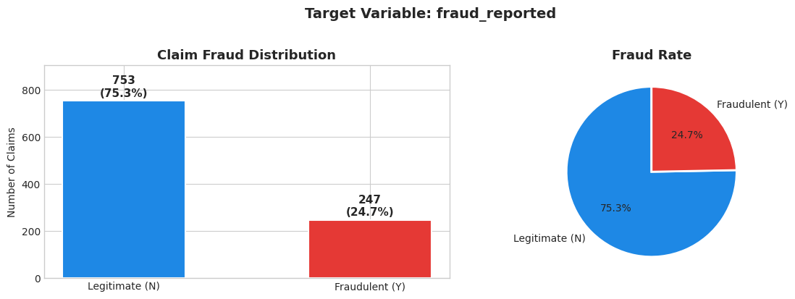
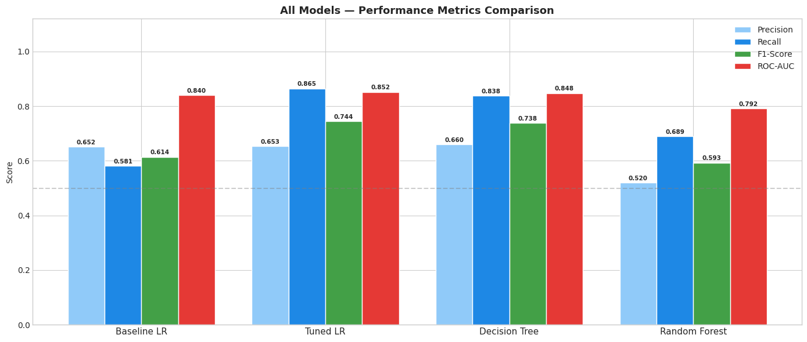
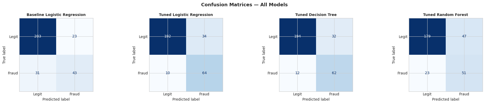

# 🚗 Auto Insurance Fraud Detection
### Phase 3: Classification Project

---

## Overview

Insurance fraud costs companies millions annually and ultimately drives up premiums for honest policyholders. This project builds a machine learning pipeline to flag potentially fraudulent auto insurance claims, allowing investigators at **Car_Nzuri Auto Insurance Company** to focus their time on the highest-risk cases.

The task is **binary classification** — predicting whether a claim is fraudulent (`Y`) or legitimate (`N`). Four models were built and evaluated iteratively, with the **Tuned Logistic Regression** emerging as the best overall performer.

---

## Business & Data Understanding

**Primary Stakeholder:** The Claims Investigation Unit of Car_Nzuri Auto Insurance Company  
**Secondary Stakeholders:** Policyholders, who benefit through fairer premiums when fraud is controlled

The dataset contains **1,000 auto insurance claims** across **39 features** — covering policyholder demographics, policy details, incident circumstances, and financial claim figures. The target variable is `fraud_reported` (Y/N).

The dataset has a moderate class imbalance, with approximately **25% of claims flagged as fraudulent**. This directly informed our choice of evaluation metrics and modelling approach.

Because missing claims (False Negatives) carry a higher financial cost than unnecessary investigations (False Positives), **F1-Score** was used as the primary tuning metric, with strong emphasis on **Recall**. ROC-AUC was tracked as a secondary measure of overall discriminatory power.

---

## Modeling

Four models were developed in sequence, each building on lessons from the previous:

**Model 1 — Baseline Logistic Regression:** Default settings, no class weighting. Established a benchmark but suffered a Recall of just 0.5811 — missing over 40% of fraudulent claims due to unaddressed class imbalance.

**Model 2 — Tuned Logistic Regression:** GridSearchCV tuned regularisation strength (`C`), penalty type (`l1`/`l2`), and added `class_weight='balanced'`. This single adjustment was the most impactful change in the entire project, boosting Recall from 0.5811 to 0.8649.

**Model 3 — Tuned Decision Tree:** Tuned `max_depth` and `min_samples_leaf` to control overfitting. Competitive performance and superior explainability — decision rules can be read from root to leaf without statistical background, which is valuable for regulatory compliance.

**Model 4 — Tuned Random Forest:** An ensemble of Decision Trees using bootstrap sampling and random feature selection. Despite being theoretically the most powerful model, it suffered the largest train-test accuracy gap (0.8543 → 0.7667), indicating the dataset was not large or complex enough to justify the ensemble's complexity.

**Key preprocessing steps:** Dropped identifier/high-cardinality columns, engineered a `claim_to_premium_ratio` feature, imputed missing values, one-hot encoded categoricals, and applied `StandardScaler` for Logistic Regression models.

---

## Evaluation

| Model | Train Acc | Test Acc | Precision | Recall | F1-Score ★ | ROC-AUC |
|:---|:---:|:---:|:---:|:---:|:---:|:---:|
| Baseline Logistic Regression | 0.9200 | 0.8200 | 0.6515 | 0.5811 | 0.6143 | 0.8403 |
| **Tuned Logistic Regression** | **0.8543** | **0.8533** | **0.6531** | **0.8649** | **0.7442** | **0.8521** |
| Tuned Decision Tree | 0.8614 | 0.8533 | 0.6596 | 0.8378 | 0.7381 | 0.8479 |
| Tuned Random Forest | 0.8543 | 0.7667 | 0.5204 | 0.6892 | 0.5930 | 0.7917 |

The **Tuned Logistic Regression** achieved the highest F1-Score (0.7442), highest ROC-AUC (0.8521), highest Recall (0.8649), and a near-zero train-test gap — confirming strong generalisation to unseen claims. The Tuned Decision Tree matched on Test Accuracy and serves as a valuable explainability layer for compliance purposes.

---

## Conclusion

Three findings stand out from this analysis:

1. **Class imbalance was the most important problem to solve.** Applying `class_weight='balanced'` was the single highest-impact intervention across all four models.
2. **Simpler models won.** Logistic Regression's linear decision boundary was the right fit for this dataset — the Random Forest's added complexity introduced overfitting rather than performance gains.
3. **Financial features dominate.** `total_claim_amount`, `claim_to_premium_ratio`, `vehicle_claim`, and `incident_severity` were the strongest predictors of fraud across every model.

**Recommendations:** Deploy the Tuned Logistic Regression as the primary fraud-scoring engine, use the Decision Tree as a compliance and explainability layer, calibrate the decision threshold to investigator capacity, and retrain the model quarterly as new labelled claims data becomes available.

---

*For full code, hyperparameter search details, and all visualisations, refer to `main.ipynb`.*
